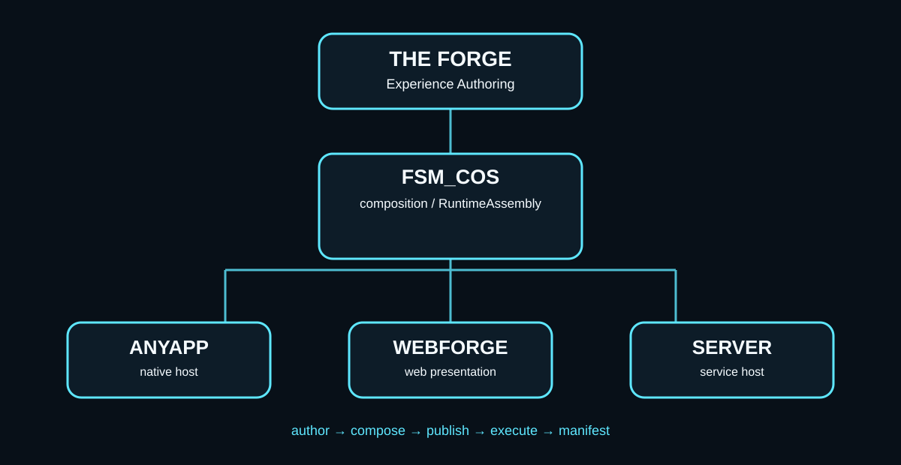

# The Forge — Architecture

The Forge is an **Experience**.

It is also the Experience through which Experiences and MicroBundles can be authored, composed, inspected, configured, validated, and published.

That distinction is fundamental:

> The Forge is not merely an editor for the Workshop. The Forge is itself a composable Workshop Experience.

## Ecosystem position

```
                         THE FORGE EXPERIENCE
                  author / compose / inspect / publish
                               |
                +--------------+--------------+
                |                             |
          MicroBundle definitions       Experience definitions
                |                             |
                +--------------+--------------+
                               |
                         published artifact
                               |
                               v
                         FSM_COS manifest
                               |
                               v
                        RuntimeAssembly
                       /       |        \
                      /        |         \
                 AnyApp     WebForge    Server Host
```

The Forge owns **authoring knowledge**.

FSM_COS owns **runtime composition**.

A host owns the facilities required to make the resulting RuntimeAssembly real.

## The Forge is not the only author

The authoring boundary must remain broader than the Forge UI.

An author may:

- use the Forge directly;
- generate an Experience with another application;
- write an artifact programmatically;
- transform an existing format into a Workshop artifact;
- create MicroBundles independently;
- compose capabilities outside the Workshop and submit the result.

The Workshop should not become the reason an author cannot create an Experience.

Therefore the important boundary is a **portable authoring artifact**, not a particular editor.

```
external author
      |
      v
portable Experience artifact
      |
      v
Forge validation / normalization / publication
      |
      v
FSM_COS execution structure
```

The Forge UI is one authoring client.

It is not the definition of authorship.

## MicroBundles

A MicroBundle represents a reusable capability composition.

The current domain package describes:

- identity;
- version;
- dependencies;
- providers.

The Forge can author those descriptions and bind opaque configuration without taking ownership of runtime implementation.

MicroBundle granularity is responsibility, not byte size.

Recursive composition remains possible: a provider may itself describe or expose another MicroBundle composition.

## Experiences

An Experience is a composition of capabilities with its own identity and context.

The Forge should eventually allow an Experience to be:

- assembled from MicroBundles;
- nested inside another Experience;
- assigned a Dynamic Environment;
- selected by ontology;
- configured without embedding runtime implementation;
- published as an immutable artifact;
- revised by publishing a new artifact/version.

The Experience itself therefore becomes a reusable building block.

## Ontology

Ontology belongs at authoring time.

The Forge can present human-readable semantic selections and translate those selections into the compact machine representation consumed by runtime composition.

The current scaffold preserves an ontology coordinate list on the editor-side Experience without making ontology a runtime object model.

This keeps the distinction clear:

```
human semantic selection
        |
        v
Forge
        |
        v
machine identity / capability membership
        |
        v
MicroBundle composition
        |
        v
FSM_COS
```

## External Experiences

The long-term goal is interoperability, not editor lock-in.

A user should be able to build an Experience elsewhere and send it to the Workshop ecosystem.

The server-side publication path can eventually look like:

```
Author application
      |
      | artifact upload
      v
Experience endpoint
      |
      +--> validate
      +--> resolve MicroBundles
      +--> verify dependencies
      +--> verify integrity
      +--> classify ontology
      +--> publish
      |
      v
catalogued Experience
      |
      v
FSM_COS host
```

The first server implementation should remain provider-neutral and runnable locally.

## Visual architecture

The Forge should explain itself visually because its job is to expose composition.



The intended presentation is a connected map rather than a conventional form-heavy editor:

```
[ONTOLOGY] ---> [CAPABILITIES] ---> [MICROBUNDLES]
      |                |                    |
      +----------------+--------------------+
                       |
                  [EXPERIENCE]
                       |
                [MANIFEST / PLAN]
                       |
                  [FSM_COS]
                       |
          +------------+-------------+
          |            |             |
       [ANYAPP]    [WEBFORGE]   [SERVER]
```

The visual representation is not merely decoration. It should become an operational view of what the Forge is composing.

## Current migration

The historical Forge repository was built around Unity and contains substantial prior work.

That work remains valuable as design history, but Unity is no longer the runtime foundation.

The new direction is:

1. preserve the useful architecture;
2. move authoring contracts into provider-neutral .NET;
3. consume published Workshop NuGet packages;
4. establish CI independently of Unity;
5. build the Forge as an Experience;
6. add a portable artifact boundary;
7. connect publication to the MicroBundle/Experience repositories;
8. let AnyApp, WebForge, and future server hosts execute the resulting compositions.

The migration should happen incrementally so the architectural decisions are testable at every step.

## Implementation status: current versus intended

The architecture above describes both the direction of the project and capabilities the project intends to provide. They are not all implemented in the current provider-neutral core.

### Present in the current core

- A .NET 8 ForgeExperience editor-side model with an identity, name, ontology coordinates, and a flat collection of MicroBundles.
- MicroBundle descriptors and opaque configuration bytes.
- Compilation of that model into the current FSM_COS RuntimeManifest contract.
- A basic ForgeSubmission validation boundary that does not require a Forge UI.
- Automated restore, build, and test checks for the provider-neutral core.

### Still design work or future implementation

- A versioned, portable Experience artifact schema and complete serialization round trip.
- Nested Experience composition and dependency resolution.
- Complete artifact validation, normalization, integrity verification, and publication.
- Generic read-only inspection of MicroBundleDefinition schemas.
- A validated authoring-edit model with provenance.
- Optional bespoke authoring-tool providers and their lifecycle, compatibility, and permission rules.
- Diegetic presentation, spatial tethering, and host-rendered authoring tools.

The current flat-list model and manifest compiler are a foundation, not proof that the full artifact or publication pipeline exists. In particular, a runtime manifest is not yet a substitute for a portable, versioned authoring artifact.

The implementation sequence is therefore: prove schema inspection against the published domain contract; establish a separate validated edit boundary; define and test the portable artifact contract; then expand composition, provider tooling, spatial presentation, and publication as independently verifiable capabilities.
