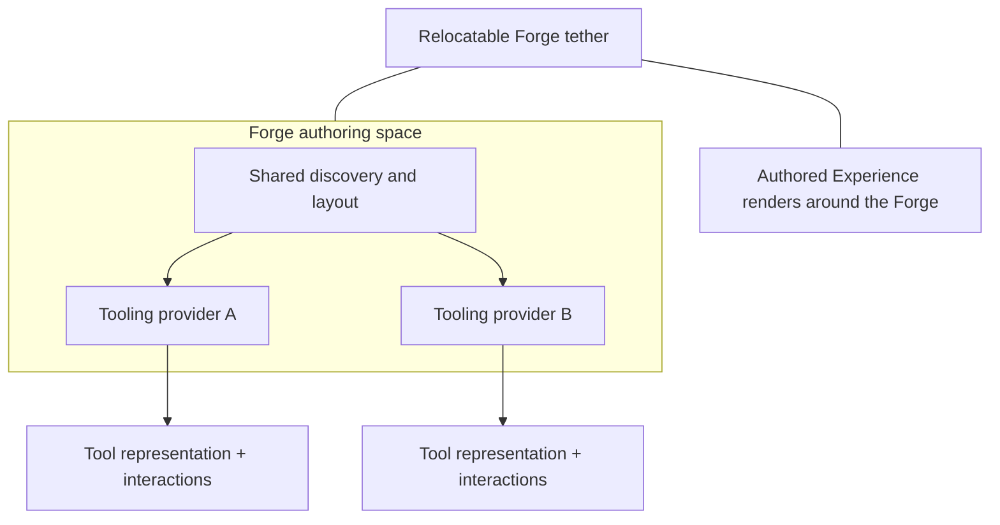

# Diegetic Experience Authoring: Questions and Design Principles

> **Status:** Design exploration — these principles and questions are not yet implemented as a complete authoring/runtime model.
>
> This document uses *diegetic* in its usual design sense: something that exists within the world or reality of an Experience, rather than only in an external interface about that world. It applies the term carefully; not every editor control needs to pretend to be an in-world object.

## The central idea

**The Forge should be able to author an Experience from within an Experience, without making the resulting artifact dependent on the Forge.**

A creator might be inside a world, encounter a workshop, open a tool, arrange capabilities, test a change, and save a new Experience. The authoring tools themselves may be represented as objects, places, characters, instruments, or processes that belong to that world. The same authoring model should also be usable by a conventional editor, command-line tool, external application, or automated producer.

That creates a useful distinction:

- **Diegetic presentation:** how authoring is encountered and understood from inside an Experience.
- **Authoring model:** the structured representation of creator intent.
- **Portable Experience artifact:** the tool-independent, versioned representation that can be stored, exchanged, reviewed, and validated.
- **Composition and runtime:** the downstream process that resolves the artifact into MicroBundles and FSM_COS requests, then lets a host manifest the result.

The diegetic interface is a view and interaction mode over the authoring model. It must not become the only place where the meaning of an Experience exists.

## A possible mental model

Imagine a creator in a simulated world who wants to make a greenhouse that grows unfamiliar plants.

1. The creator enters a workshop in that world.
2. They select a plant-growth capability, a lighting capability, a climate capability, and a visual representation.
3. The workshop shows the relationships and constraints among them—not just a list of files.
4. The creator tests the proposed composition in a bounded preview.
5. The system explains missing dependencies, incompatible versions, and unresolved choices in terms the creator can understand.
6. The creator saves a versioned Experience artifact.
7. The artifact can be reopened in a different editor or submitted to a host that does not contain the original workshop.

The greenhouse is the authored Experience. The in-world workshop is one possible authoring interface. The Forge is the authoring system that gives that interface a coherent vocabulary and behavior.

This example is illustrative, not a claim that these interactions exist today.

## The Forge's "Iron": deliberate data manipulation

The Forge is not merely a scene editor or a collection of diegetic widgets. Its core responsibility is to make structured data understandable and safely transformable: create definitions, inspect schemas, compose MicroBundles, edit configuration, resolve relationships, validate changes, and prepare portable artifacts. The world-facing tools are expressive handles on that underlying authoring system.

A useful guiding image is a **conveyor belt that passes through the Forge wall and disappears into the ether**. The creator can see the object or artifact being worked on, the current operation, its provenance, and the checks it has passed. They do not need to see every internal mechanism or pretend the entire downstream ecosystem is physically inside the room. The disappearance beyond the wall communicates that the Forge can prepare and hand off work to systems beyond its immediate presentation. It must not imply that an artifact has been published, executed, or accepted unless that has actually happened.

### Runtime changes must use FSM_API as the reference

The Workshop's [FSM_API](https://github.com/TrentBest/FSM_API) is the authoritative reference when designing runtime behavior changes. It is not a generic FSM placeholder: its definitions are runtime-modifiable, it separates behavior from POCO context data, and structural modifications are deferred so they can be applied safely after an update cycle rather than corrupting the active tick. Its named processing groups and instance lifecycle are also part of the real API vocabulary.

That distinction changes how Forge should be designed:

- **Authoring edits** change the creator's proposed Experience or MicroBundle configuration.
- **Runtime structural changes** change the live FSM/API structures through the actual FSM_API capabilities and their mutation-safety rules.
- **Runtime context changes** change data owned by the running system, with the context and its invariants remaining explicit.
- **Presentation changes** move, select, open, or arrange diegetic tools and must not silently alter the authored artifact or live runtime.
- **Compilation/composition** translates an authored artifact into the downstream FSM_COS/runtime contracts; it is not itself proof that a live FSM has been changed.

Forge should call or generate against real package contracts, not invent a parallel "runtime mutation" abstraction that accidentally restricts FSM_API or misrepresents its guarantees. Where a request cannot safely take effect during the current tick, the UI should show it as pending or queued rather than pretending it happened immediately. Use public APIs; do not build on FSM_API internals or bypass its safety checks.

The current Forge schema inspector is read-only and does not yet edit configuration or mutate running FSM definitions. These are architectural requirements for the next stages, not claims about current implementation.

### Example: a solar-system materials area

Imagine a section of the Forge that resembles a carefully arranged collection of physical boxes. Each box represents a discoverable asset or authored component: planets, moons, rings, asteroid groups, orbital systems, or other celestial objects. The creator can pick up a planet box and place its contents into a bounded simulation area.

That interaction should be a sequence of explicit operations:

1. **Discover:** show the box's identity, source, version, and available contents.
2. **Place into the work area:** create an authored reference or instance in the current draft. Do not silently alter the source asset or the live world.
3. **Inspect:** expose meaningful metadata and relationships around the placed object—name, classification, dimensions, mass, orbital parameters, dependencies, provenance, and domain-specific fields when the supplying schema supports them.
4. **Edit deliberately:** provide suitable controls for supported fields, explain units and constraints, validate the proposed value, and show whether the edit is draft-only or intended for a live system.
5. **Preview safely:** show the consequences in an isolated or explicitly bounded simulation.
6. **Commit or discard:** record accepted changes with their origin; preserve the previous valid draft when validation fails.
7. **Hand off:** make the resulting Experience artifact's state visible as it enters the conveyor/handoff path. Publication and runtime activation remain separate, explicit outcomes.

The box is a diegetic metaphor for discovery and packaging, not a requirement that every asset be a literal box. Some assets may be represented by a specimen, instrument, model, shelf, hologram, or another suitable form. The shared Forge contract is identity, discoverability, placement semantics, inspection, validated editing, provenance, and clear handoff—not one universal visual shape.

This example is design direction, not implemented functionality. The current schema contract does not itself guarantee that all the listed planetary properties exist; metadata and editable fields must come from explicit domain schemas or authored data, never from guesses based on an object's appearance.

## Principles worth preserving

### 1. In-world does not mean trapped in-world

A diegetic authoring session must be recoverable outside the world. There should be an ordinary way to inspect, export, compare, validate, and repair the underlying artifact even if the immersive presentation is unavailable or broken.

### 2. The authoring model is more durable than any editor

The Forge UI, an in-world workbench, a CLI, and a third-party editor should all express the same core authoring concepts. Presentation-specific state—camera position, selected object, open panels, animation state—must not silently become semantic runtime configuration.

### 3. Show relationships, not merely containers

A MicroBundle should not be presented only as a tile in a drawer. The author should be able to understand what it provides, what it requires, where it came from, which version is resolved, what configuration applies, and what changes if it is removed or replaced.

### 4. Make invisible constraints legible

The system should explain ontology matching, dependency resolution, conflicts, configuration ownership, permissions, and validation results. Visual metaphors can help, but they must not replace precise names, details, and diagnostics.

### 5. Preview is not publication

An Experience preview should be isolated from the creator's active world and from other users unless the host explicitly grants otherwise. Testing a composition must not silently publish it, overwrite a shared artifact, or mutate the live Experience.

### 6. Authoring should be composable too

The Forge may itself be assembled from MicroBundles and Experiences. An in-world workbench could be one Experience that uses editor capabilities, while a host-independent authoring model remains outside that presentation. Self-hosting is a useful direction, not permission to make the model depend on its own UI.

### 7. Preserve provenance and explain changes

Creators should be able to ask: What did I add? What did the resolver choose? Which dependencies came from a child Experience? Why did validation fail? What changed between these two versions? Answers should come from stored identities, resolution records, and diagnostics—not from reconstructing intent from the visual scene.

## Spatial model: a tethered Forge with a world around it

The creator's description adds a more specific spatial contract to the general diegetic-authoring idea:

**The Forge is a place-like authoring presence that can be tethered to a chosen location in the Experience, without being a literal place that the authored world must contain.**

The tether is relocatable. In an Experience that spans several star systems, a creator could place the Forge near a planet, station, ship, remote outpost, or another meaningful context—and later move it elsewhere. The Experience is not constrained to the Forge's current location, and moving the Forge must not change the Experience's semantic identity or composition.

### Two spatial domains, one authoring session

- **Around the Forge — the authored Experience.** Render the world or context currently being created. Its geography, scale, and contents belong to the Experience and may extend far beyond the creator's immediate surroundings.
- **Within the Forge — the authoring environment.** Render tools, inspectors, composition relationships, diagnostics, and other authoring affordances contributed by installed tooling.
- **At the tether — the relationship between them.** Keep the Forge anchored to a meaningful point or context in the authored Experience, while allowing the creator to relocate that anchor without rewriting the artifact.

This is a proposed spatial model, not a description of current code.

*Conceptual diagram: the tether relates the Forge to the authored world; providers contribute tool representations inside the Forge. It does not describe implemented classes or APIs.*

### Tooling providers supply representations

A MicroBundle may provide runtime capability, authoring tooling, both, or neither. If it supplies tooling, it should be able to expose a provider contract through which the Forge discovers and presents its authoring representation. That representation might be a workbench, instrument, spatial panel, inspectable object, process visualization, or another interaction surface appropriate to the tool.

The Forge should own the shared hosting rules—not bespoke knowledge of every tool:

1. Discover which installed MicroBundles offer authoring tooling.
2. Ask each tooling provider for its declared representation and interaction contract.
3. Place that representation in the Forge's tooling space according to shared layout, placement, lifecycle, and accessibility rules.
4. Route interactions to the owning tool/provider and make its relevant state and diagnostics visible.
5. Keep tool presentation metadata distinct from the authored Experience's semantic configuration unless a creator explicitly commits a change to the artifact.

A MicroBundle without a tooling provider remains valid. It may participate in the authored Experience without creating an empty panel, placeholder station, or mandatory Forge UI.

The exact provider API, version negotiation, permissions, lifecycle, and layout contract remain open design work. A provider should not be allowed to silently replace the Forge's trust boundary or acquire permissions merely because its representation is visible.

### Spatial composition is not semantic composition

The Forge's current tether, camera, local arrangement of tools, and open inspection surfaces are presentation/session state. They should not silently alter the Experience being authored. Conversely, a creator's deliberate edit made through a tool—such as changing a bundle's configuration—must be captured as an explicit authoring-model change with understandable provenance.

This suggests three distinct records:

- **Experience definition:** the portable creator-authored composition.
- **Forge session:** the tether target, spatial arrangement, active tool representations, selections, and other presentation state.
- **Tooling provider declaration:** the tool's identity, supported representation(s), interaction entry point, required capabilities, and lifecycle/permission needs.

These are conceptual boundaries, not proposed final type names. The proposed responsibilities and lifecycle for an optional authoring-tool contribution are developed in [Forge Tooling Provider Contract: Design Direction](tooling-provider-contract.md).

### Questions this spatial model must answer

- What can a tether target be: a coordinate, a named entity, a stable world-space anchor, a semantic location, or a combination?
- What happens when the target moves, disappears, changes identity, or is unavailable in another host?
- Does a tether describe a persistent preference, a session-only location, or both?
- Is the Forge's interior spatially bounded, infinitely extensible, or host-adaptive?
- How do providers request space without controlling the overall layout or obstructing other tools?
- Can multiple tools share a station or compose into a larger tool experience?
- How are tools discovered, versioned, permissioned, unloaded, and recovered if a provider fails?
- Which interaction state persists across sessions, and which state is disposable?
- What non-diegetic fallback is available for accessibility, debugging, small screens, or hosts without spatial rendering?

**Working recommendation:** make the tether and tool layout portable session metadata, define tooling as an optional provider capability, and keep the portable Experience definition independent of any specific tether, spatial renderer, or tooling presentation.

## The design questions

These questions should be answered explicitly before they become hidden assumptions in code.

### A. What exactly is an Experience?

- Is an Experience a deployable composition, an authored source document, a running session, or a family of related artifacts?
- Should these be distinct types—such as *Experience Definition*, *Resolved Experience*, and *Experience Session*—or distinct states of one identity?
- Which identity survives editing, saving a new version, copying an Experience, and running multiple instances?
- Is an Experience allowed to contain child Experiences, MicroBundles, ordered process structures, or all three?
- Which structures are semantic and portable, and which are host-specific presentation or execution details?

**Working recommendation:** distinguish the editable definition, the resolved composition, and a live runtime instance in the model, even if their first implementation shares some DTOs. They answer different questions and have different lifecycles.

### B. What does it mean for authoring to be diegetic?

- Must every authoring action have an in-world explanation, or may a creator open a conventional overlay when that is clearer?
- Is a tool an object in the world, a character/service, a location, a visible graph, or any of these?
- Can the same authoring operation be invoked without entering the world?
- How should the system communicate errors that have no useful in-world metaphor?
- Does in-world time pass during authoring? Can authoring pause the Experience, fork a sandbox, or operate asynchronously?
- How does a creator distinguish a simulated object from a real authoring control that can save, publish, or grant permissions?

**Working recommendation:** treat diegesis as a presentation and interaction contract, not a restriction on the underlying authoring API. Allow explicit non-diegetic inspection and safety controls where they improve clarity.

### C. What is a MicroBundle's contract?

- Which fields are required to identify a capability independently of its display name?
- What exactly is provided, required, optional, or incompatible?
- Are dependencies declarations, runtime providers, ontology relationships, or separate concepts?
- How are versions pinned and resolved?
- Can a MicroBundle request permissions or access to resources? If so, how are those requests declared and reviewed?
- Is configuration opaque by default, and how can a schema-aware editor safely expose fields without owning the payload format?
- What is the boundary between a MicroBundle's semantic identity and one configured instance of it?

**Working recommendation:** model identity, version, declared capability, dependency requirements, configuration schema metadata, and permissions as distinct concerns. Do not infer them from labels or visual appearance.

### D. How do nested Experiences compose?

- Does a parent reference a child artifact by immutable identity and version, or embed its contents?
- Can the same child appear in several branches?
- If the same capability is reached through two paths, does it mean one shared instance or two configured instances?
- Can a parent override child configuration? If so, which fields are overridable and what precedence applies?
- Does ordering carry meaning, or is order a presentation detail until a separate execution structure says otherwise?
- How are cycles, incompatible versions, missing references, and conflicting requirements reported?
- What resource limits protect a host from an untrusted or unexpectedly large composition graph?

**Working recommendation:** start with immutable versioned references, explicit composition-entry identities, deterministic resolution, cycle detection, bounded expansion, and structured diagnostics. Do not silently deduplicate by numeric ID alone.

### E. What is the ontology for?

- Does ontology classify a capability, select candidates, constrain composition, describe relationships, or do all of these through separate operations?
- What happens when several MicroBundles match a query?
- Can a creator express “any compatible capability,” “this exact provider,” or “one of these alternatives”?
- Who resolves ambiguity: the author, an arbitrator, the catalog, or the host?
- How does the creator inspect why a capability was selected?
- Can ontology schemes evolve independently, and how are unknown terms handled?

**Working recommendation:** ontology should improve discovery and reasoning, not become an implicit instruction to choose a provider without explanation. Selection policy and resolution evidence must remain inspectable.

### F. What does the Forge own versus FSM_COS?

- Does the Forge validate authoring intent before handing composition requests to FSM_COS?
- Which validations are shared, and which belong exclusively to the runtime boundary?
- What information must survive compilation for debugging and provenance?
- Can a portable artifact be validated without launching FSM_COS or a host?
- How are host-specific capabilities declared without making the portable artifact dependent on one host?

**Working recommendation:** Forge validates artifact structure, authoring semantics, references, and portable constraints. FSM_COS retains authority over its own composition, arbitration, and runtime contracts. A host owns manifestation, lifecycle, and environment-specific execution.

### G. What does “publish” mean?

- Is publication saving a draft, making an immutable version available, listing it in a catalog, granting others access, or deploying it to a host?
- Are these separate operations with separate permissions and audit events?
- Can a published artifact be changed in place, or does every semantic change create a new version?
- Who owns trust decisions for an externally submitted artifact?
- What does rollback mean after other Experiences have referenced a published version?

**Working recommendation:** separate save, validate, publish, distribute, install, and run. Avoid a single button or API call whose consequences vary by context.

### H. How do trust and safety work?

- Can an Experience contain executable providers, scripts, network access, file access, or other effects?
- Which declared capabilities require explicit user or host permission?
- What is sandboxed during preview, and what is trusted only after installation?
- Can authors inspect the provenance and declared permissions of a dependency before accepting it?
- How are resource exhaustion, malicious nesting, dependency substitution, and revocation handled?
- What actions are reversible, and which require a clear confirmation?

**Working recommendation:** a portable artifact is data, not proof of safety. Validate identities and versions, enforce resource limits, expose requested capabilities, and keep preview isolated from publication and execution.

### I. What does a creator experience while authoring?

- Is the main interaction a spatial graph, a workshop with tools, direct manipulation of objects, a conversation, a conventional form, or a combination?
- How can the creator move between intuitive visual composition and exact technical inspection?
- What is the smallest useful action for a newcomer?
- Can experts bypass the guided experience without bypassing validation?
- How should the Forge show uncertainty, missing information, conflicts, and consequences before the creator commits?
- How can an Experience explain how it was built, not just how to run it?

**Working recommendation:** offer multiple views over one source of truth: an approachable in-world view, a graph/relationship view, and a precise inspection view. None should maintain a competing private copy of the composition.

## Proposed lifecycle vocabulary

These labels are a discussion aid, not a finalized API:

| Stage | Meaning | Important boundary |
|---|---|---|
| **Draft** | Creator intent is being edited | May be incomplete; not assumed runnable |
| **Validated** | A specific artifact version passed named validation rules | Validation is scoped and time/version-specific |
| **Resolved** | References and versions have been selected and recorded | Resolution does not itself grant trust |
| **Composed** | Validated requests have been handed through FSM_COS composition/arbitration | Runtime contracts remain authoritative |
| **Previewed** | A host ran an isolated preview | Preview is not publication |
| **Published** | An immutable version is available under a defined policy | Does not necessarily mean installed or trusted |
| **Installed** | A host accepted an artifact for use | Permission and trust policies apply |
| **Running** | A host has created a live instance | Runtime state is not the portable definition |

A real implementation may combine stages, but the semantics should remain distinguishable.

## Questions to answer first

To avoid designing every future feature at once, the first decisions should be:

1. **Artifact identity:** What distinguishes an Experience definition from a resolved composition and a running instance?
2. **Portable boundary:** Which fields are part of the portable artifact, and which belong only to an editor or host?
3. **Composition entry:** How does an Experience reference a MicroBundle or child Experience, including version and configuration?
4. **Shared-reference semantics:** When the same dependency appears more than once, when is it shared and when is it a distinct instance?
5. **Resolution and diagnostics:** Who resolves references, and what evidence must be returned when resolution succeeds or fails?
6. **Trust lifecycle:** Which actions are merely local editing, and which can publish, install, or execute something?
7. **Diegetic escape hatch:** How can a creator inspect, export, repair, or recover the artifact without relying on the immersive UI?

These decisions form the spine of the first portable artifact schema and its acceptance tests.

## Current implementation boundary

The current provider-neutral Forge core is still much narrower than this vision: it holds a flat list of MicroBundles and compiles that list into an FSM_COS RuntimeManifest. The portable versioned artifact, nested Experience graph, complete resolver, diegetic authoring interface, and publication pipeline described here are design directions—not completed functionality.

See [Experience Composition: Current State and Design Direction](experience-composition-design.md) for the proposed composition pipeline and nested-graph rules.

## Related vocabulary

- **Diegetic:** part of the represented world or reality of the Experience.
- **Non-diegetic:** presented outside that world, such as an external editor panel or diagnostic overlay.
- **Authoring model:** structured creator intent independent of a particular interface.
- **Portable artifact:** a versioned representation that can move between tools and hosts.
- **Resolved composition:** a particular interpretation of references, versions, and configuration.
- **Runtime instance:** a live manifestation hosted in a specific environment.

The goal is not to make every pixel pretend to belong to the world. The goal is to let creation feel native to the Experience while keeping its underlying structure explicit, portable, testable, and trustworthy.
