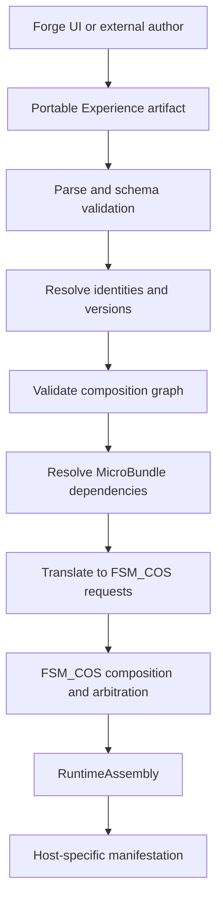
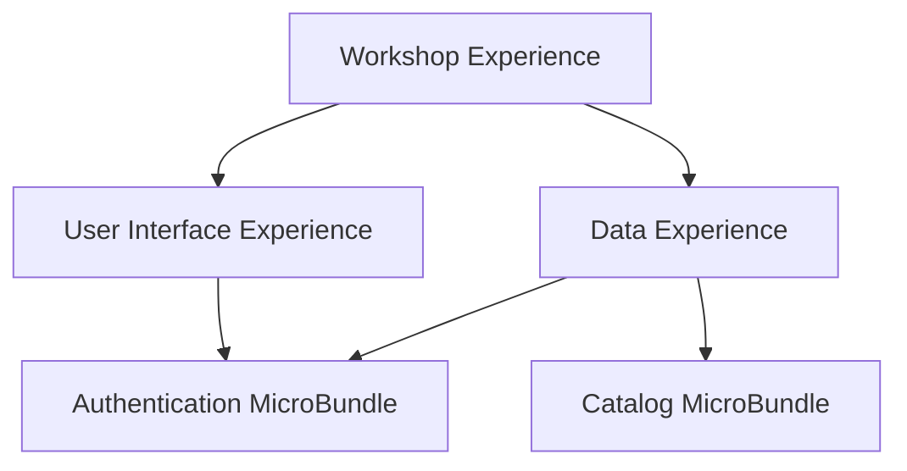
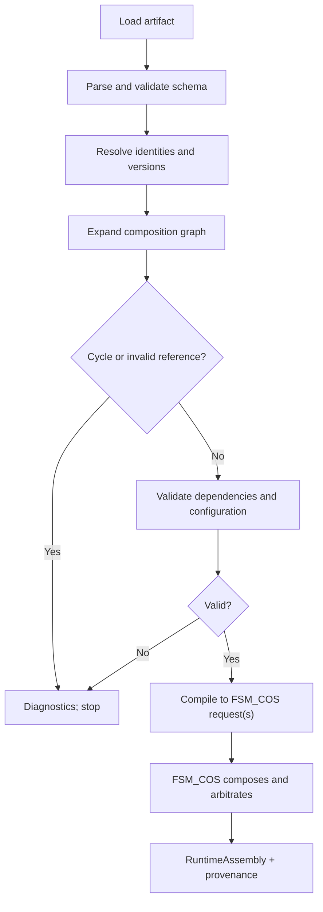

# Experience Composition: Current State and Design Direction

> **Status:** Design proposal — not yet implemented.
>
> This document describes the current provider-neutral Forge core and proposes a portable composition model. It follows the [Workshop Documentation Standard](https://github.com/TrentBest/TheSingularityWorkshop.FSM_COS/blob/development/DOCUMENTATION_STANDARD.md). As a focused design document, it uses local headings rather than assigning global README section IDs to unrelated topics.

## The promise

**The Forge authors. FSM_COS composes. The host makes it real.**

The Forge must be capable of expressing an Experience without requiring the Forge UI itself. The artifact should be portable between authoring tools, validate independently of presentation, and translate into runtime contracts without making runtime packages depend on the Forge.

## Responsibility boundaries

- **Forge authoring model:** creator intent, composition structure, references, authoring metadata, configuration, and diagnostics.
- **Portable Experience artifact:** stable interchange format independent of a specific editor or host.
- **MicroBundleDomain:** semantic contracts for individual capabilities.
- **MicroBundleRepository:** immutable artifact storage and publication concerns.
- **FSM_COS:** composition, dependency closure, arbitration, and runtime assembly.
- **Host:** presentation, lifecycle, and execution in its environment.

Lower-level packages must not acquire a dependency on The Forge.

## What the current core proves

The provider-neutral ForgeExperience currently:

- has a non-zero numeric ID, a name, and an integer ontology list;
- stores a flat list of ForgeMicroBundle entries;
- describes each bundle with a MicroBundleDescriptor and opaque configuration bytes;
- rejects duplicate MicroBundle IDs within the same Experience;
- compiles that flat list into an FSM_COS RuntimeManifest containing BundleRequest entries.

ForgeSubmission currently provides a minimal wrapper and basic null/format/version checks. This is not yet a full external artifact submission pipeline.

The current model does **not** yet establish a serialized, versioned portable Experience schema, nested Experience references, graph-cycle detection, identity/version resolution, configuration override rules, or complete submission diagnostics. Do not describe these as implemented until code and tests prove them.

## Proposed portable model

Keep the authoring artifact distinct from FSM_COS.RuntimeManifest. The authoring artifact records creator intent and portable references; the runtime manifest is a target-specific compilation product.

A first schema should define:

- **Schema identity:** format identifier and schema version, independent of the Experience's own version.
- **Experience identity:** stable ID, human-readable name, version, and ontology/classification references.
- **Composition entries:** explicitly typed references to MicroBundles or child Experiences.
- **Version policy:** exact, compatible-range, or host/catalog-selected resolution must be explicit; never silently choose a different version.
- **Configuration:** opaque payload plus an optional declared encoding/schema identity. The Forge may inspect editor metadata when available, but must not reinterpret unknown payloads.
- **Composition metadata:** stable entry IDs, ordering where meaningful, labels, and authoring annotations separated from runtime configuration.
- **Integrity/provenance:** resolved artifact identities and versions, source artifact, and validation report where appropriate.
- **Extensibility:** unknown optional fields should have a defined forward-compatibility policy; unknown required semantics must fail validation.

Prefer references to immutable, versioned child artifacts over copying child definitions into the parent. If embedding is later supported, define its identity and conflict semantics separately.

## Nested Experiences are a graph, not merely recursive lists

A child Experience can itself reference MicroBundles and other Experiences. That creates a directed composition graph.

In this example, the shared Authentication capability is referenced by two branches. The model must specify whether this resolves to one shared capability instance or two separately configured entries; identity reuse alone must not leave runtime semantics ambiguous.

Validation must detect cycles using a traversal stack or equivalent graph algorithm, not reject all repeated references. A repeated reference can be a valid shared dependency; a cycle is a path that reaches an ancestor currently being expanded.

### Required nested-composition rules

1. Resolve every Experience and MicroBundle reference to a stable identity and version before runtime translation.
2. Detect cycles and report the complete reference path, such as A → B → C → A.
3. Define duplicate behavior explicitly: shared reference, distinct composition entry, or conflict. Never deduplicate only by numeric ID if version/configuration differ.
4. Define configuration ownership and override rules. Parent defaults, child defaults, and instance-specific configuration must have a deterministic precedence model; if no model is agreed, reject ambiguous overrides rather than guessing.
5. Preserve the origin of every resolved entry for diagnostics and explainability.
6. Apply dependency closure and compatibility validation across the resolved graph.
7. Bound resource use for untrusted external artifacts: graph depth, node count, payload sizes, and resolution work need configurable limits.
8. Produce actionable diagnostics that identify the artifact, composition path, and reason for failure.

## Validation and compilation pipeline

Compilation should return structured diagnostics or a typed result rather than relying on exceptions for expected authoring errors. Exceptions remain appropriate for programmer errors and truly exceptional runtime failures.

The Forge validates authoring semantics before handing requests to FSM_COS. FSM_COS remains responsible for its own runtime contracts and arbitration; Forge validation does not replace runtime validation.

## Documentation and status vocabulary

Every Forge-facing design document and implementation report should clearly distinguish:

- **Implemented:** present in code and covered by relevant tests.
- **Partial:** some behavior exists, with named limitations.
- **Proposed:** a design recommendation not yet implemented.
- **Decision required:** a product or semantic choice that must not be silently invented.
- **Deferred:** intentionally out of current scope.

Do not use future-tense architecture prose as evidence of current behavior. Link each implemented claim to the relevant type, method, or test when practical.

## Acceptance tests for nested composition

Before calling nested Experiences supported, tests should cover:

- a parent containing one child Experience;
- multiple levels of nesting;
- shared child references through separate branches;
- a direct self-cycle and a multi-node cycle, with readable paths;
- missing artifact and incompatible-version diagnostics;
- duplicate MicroBundle identities with differing configuration;
- deterministic configuration precedence or explicit rejection of ambiguity;
- dependency closure across child boundaries;
- graph-depth, node-count, and payload limits;
- serialization/deserialization round-trip of the portable artifact;
- equivalent output when the artifact is authored by the Forge UI versus an external producer;
- preservation of provenance from source artifact to runtime requests.

## Decisions still required

These are deliberately not settled by this proposal:

1. Is an Experience's own version required in the first portable schema, and what version grammar governs it?
2. Which version-resolution policies are permitted, and who supplies the catalog/resolver?
3. Does a repeated child reference mean one shared runtime instance, separate instances, or an explicit selectable policy?
4. Are child configurations immutable defaults, inherited values, or instance overrides? What merge semantics, if any, are allowed?
5. Does ordering have runtime meaning, or is composition unordered until a separate execution-structure contract is introduced?
6. Which serialization format and compatibility policy are canonical?
7. Which limits are safe defaults for externally submitted artifacts?

## Immediate implementation sequence

1. Define the portable artifact DTO/schema and serialization round-trip before changing runtime compilation.
2. Add a resolver abstraction for immutable artifact identities and versions; keep storage implementation outside the Forge core.
3. Build a graph-expansion/validation stage with structured diagnostics and provenance.
4. Define configuration and shared-reference semantics through explicit decisions and tests.
5. Compile a validated, resolved graph to the existing FSM_COS contracts.
6. Add external-author parity tests and only then describe the artifact as portable end-to-end.

No NuGet publication is part of this work. No branch merge should occur without review.
