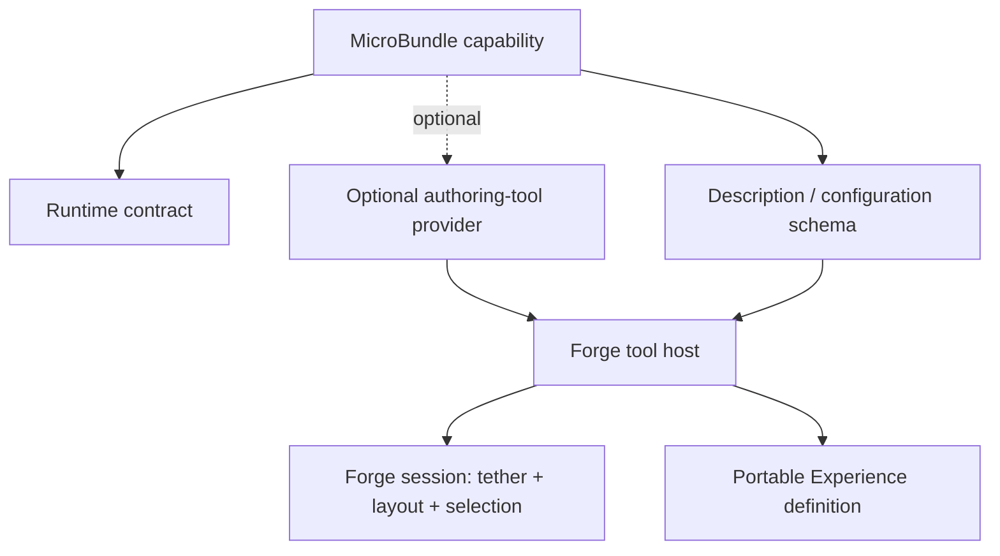

# Forge Tooling Provider Contract: Design Direction

> **Status:** Proposed design. This document defines a direction for discussion and future implementation; it does not claim that diegetic tooling providers or a spatial Forge currently exist.

## Purpose

The Forge should not need to know every domain-specific tool in advance. When a MicroBundle offers useful authoring tools, it should be able to describe those tools and provide an implementation that the Forge can host within its own authoring space.

The creator experiences one coherent Forge. The installed capabilities contribute tools; the Forge remains responsible for discovery, placement, interaction routing, lifecycle, permissions, and the surrounding experience.

The Forge itself is envisioned as a **relocatable, tethered authoring presence**. The Experience being created renders around it. Inside the Forge, optional tooling providers contribute representations and interactions. The Forge may be tethered to a location in a world spanning a room, a planet, or multiple star systems without making that location a required part of the portable Experience.

## The existing seam: description is not diegetic presentation

MicroBundleDomain already distinguishes two related contracts:

- **Runtime contract:** an executable capability participates in loading and composition.
- **Description contract:** editors and tooling can inspect and author configurable structure without executing the capability.

The description contract—centered on `MicroBundleDefinition` and `MicroBundleField`—is a valuable foundation for conventional configuration tooling. It should not be mistaken for a complete diegetic tooling contract. A field schema can explain which settings exist; it does not, by itself, specify a spatial representation, interaction lifecycle, layout needs, or permissions for an in-world tool.

Likewise, a runtime provider declaration is not automatically an authoring tool. Runtime behavior and authoring interaction have different consumers, privileges, and lifecycles.

**Design recommendation:** preserve these as separate concepts that can be connected by a MicroBundle, rather than making the runtime contract carry UI-specific assumptions or requiring every bundle to ship a tool.

## Four separate responsibilities

- **Runtime capability:** what the bundle contributes when composed or run.
- **Description/schema:** what authoring software can inspect and edit as structured data.
- **Authoring-tool provider:** an optional contribution that makes a capability easier to discover, configure, diagnose, or otherwise work with.
- **Forge host/session:** the shared place that discovers and hosts tools, mediates interaction, and stores presentation state.

These are conceptual boundaries, not final type names or a committed public API.

## Proposed provider responsibilities

A tooling provider should declare enough information for the Forge to make safe, useful hosting decisions without learning the private domain of every tool.

| Concern | What the provider should communicate | What the Forge must retain control over |
|---|---|---|
| Identity | Stable provider identity, version, associated capability identity | Identity collision handling and compatible-version policy |
| Purpose | Human-readable name, concise description, intended authoring tasks | Discovery, sorting, and clear presentation of provenance |
| Representation | Supported presentation modes, preferred form, minimum/ideal spatial needs | Placement, shared-space limits, host adaptation, and fallback |
| Interaction | Entry point and supported interaction model | Input routing, focus, cancellation, and conflict handling |
| Authoring effects | Which model objects/settings may be read or changed | Validation, change recording, undo policy, and save boundaries |
| Capabilities | Requested access to data, services, files, network, or other privileged resources | Grant/deny decisions, isolation, and revocation |
| Lifecycle | Initialization, readiness, suspension, disposal, and recoverable failure signals | Scheduling, timeout/resource policy, cleanup, and user-visible diagnostics |
| Accessibility | Non-spatial or alternative interaction modes, labels, keyboard/controller expectations | Accessibility guarantees and available host fallbacks |

This table describes desired responsibilities, not a schema that exists in the current package.

### Optional means genuinely optional

A MicroBundle without authoring tooling must still be discoverable, configurable through generic schema tooling when a schema is available, validated, composed, and used at runtime. It should not need to provide an empty panel, a placeholder object, or a fake spatial presence.

A bundle with a tool should not require the Forge to be rebuilt just to recognize a new domain. The provider contributes its tool; the Forge supplies the shared hosting rules.

A host that cannot render a spatial tool should still be able to offer an appropriate supported alternative where possible, such as a conventional inspector or a clear “unsupported presentation” explanation. It must not silently imply that a tool is available when it is not.

## The tether is session state, not Experience semantics

The Forge's location and the authored world's meaning are separate concerns.

**Portable Experience definition** may contain semantic world content and references to capabilities. It should not acquire hidden changes merely because the creator moves the Forge, rotates a tool station, changes camera position, or opens a panel.

**Forge session state** may contain:
- tether target and tether-resolution status;
- relative Forge orientation and presentation scale;
- tool placement and grouping;
- selected capability, focused tool, and open inspection surfaces;
- local preview and navigation state.

**Explicit authoring changes** made through a tool—such as changing a MicroBundle's configuration—must be committed to the authoring model as deliberate edits. They should be distinguishable from tool movement or other presentation-only changes and should carry provenance sufficient to explain what changed and which tool initiated it.

Session state may be saved for convenience, but it should remain a separately versioned/session-scoped record rather than silently becoming part of the portable Experience artifact.

## A tether needs identity, not just a point

A raw coordinate can be useful for initial placement, but it is not a complete cross-host tether contract. A future model should distinguish possible target kinds, for example:

- a world-space coordinate or transform;
- a stable entity/object identity;
- a named or semantic anchor;
- a host-provided anchor reference.

These are candidate kinds, not a finalized enumeration. The contract needs explicit behavior when a target moves, is deleted, is unloaded, cannot be resolved in another host, or is not meaningful in a non-spatial editor. It should report the status and offer a safe fallback; it should not silently retether to an unrelated target.

The Forge should support relocation as a presentation operation. Moving the tether must not rewrite the Experience's identity, dependency graph, or capability configuration.

## Layout is a shared service

Providers should express constraints and preferences—not dictate the entire Forge layout. The host should be able to place tools in a shared spatial arrangement, group related tools, prevent collisions, manage limited space, and adapt to the current renderer or display.

A provider may suggest that a tool is best represented as a workbench, instrument, graph, character, or floating inspector. Those are representations of the same authoring capability, not separate meanings of the Experience. Exact spatial metaphors should remain domain-appropriate and optional.

Layout negotiation should account for:
- preferred and minimum footprint;
- grouping and adjacency preferences;
- whether the tool needs continuous visibility or can be opened on demand;
- interaction focus and conflicts;
- host limits and accessibility fallback.

The first implementation should favor a small, constrained layout vocabulary over an elaborate universal spatial-layout engine.

## Interaction and trust boundaries

A tool's visible presence is not permission to perform arbitrary actions. The Forge should mediate model mutations and privileged operations. A provider should request only the access it needs, and the host should decide what is granted under the current user's and host's policies.

At minimum, a future contract needs to answer:

1. What authoring objects can the tool inspect?
2. What authoring changes can it propose or commit?
3. Which operations require user confirmation?
4. Can it access runtime data, external resources, or live Experience state?
5. How are edits validated, attributed, undone, and recovered after provider failure?
6. What happens if a tool becomes unavailable or its version is incompatible?

A preview must remain distinct from publication and live execution. Tooling should not be able to bypass those boundaries simply because it runs inside the Forge.

## Lifecycle sketch

This is a conceptual lifecycle, not an implemented API:

1. The Forge discovers an optional tooling declaration associated with an installed capability.
2. The Forge checks identity/version compatibility and the provider's declared requirements.
3. The host evaluates permissions and presentation support before activation.
4. The provider supplies a representation/interaction contribution through a host-controlled boundary.
5. The Forge places it according to shared layout rules and exposes it to the creator.
6. The provider requests changes through an authoring interface; the Forge validates and records accepted edits.
7. On close, unload, failure, or permission revocation, the Forge releases resources and preserves already-committed authoring changes.
8. The session may remember the tool's arrangement independently of the portable Experience.

The Forge should surface meaningful states—unavailable, awaiting permission, loading, ready, degraded, failed, and closed—rather than treating every failure as an empty space.

## Decisions to defer until they can be made with evidence

- The exact public interfaces, package placement, and dependency direction.
- Whether providers supply executable UI components, declarative descriptions, remote surfaces, or multiple presentation adapters.
- Whether a provider is distributed inside a MicroBundle, alongside it, or referenced as a separately versioned artifact.
- The canonical target identity and persistence format for tethering.
- How layout constraints are expressed and negotiated.
- How schema-driven generic inspectors and bespoke domain tools share focus, navigation, accessibility, and undo.
- How provider sandboxing and capability grants map to the actual host architecture.

These choices should be checked against existing MicroBundleDomain description/runtime contracts, FSM_COS composition boundaries, and real host capabilities before code is introduced. Avoid adding Forge-specific dependencies to MicroBundleDomain merely to accelerate a prototype.

## Recommended implementation sequence

1. **Document and review the conceptual boundaries** — runtime, description, optional tooling, Forge session, and portable Experience.
2. **Inspect the current description contract and consumers** — identify what can be reused without conflating schema inspection with tool hosting.
3. **Write a small host-neutral provider proposal** — identity, representation options, interaction entry point, permissions, lifecycle, and authoring-change boundary; no spatial renderer dependency.
4. **Prototype with one generic schema inspector and one optional bespoke tool** — prove that a bundle without tooling still works and that the Forge need not hard-code the domain.
5. **Add a non-spatial fallback** — validate the same authoring operations outside a spatial host.
6. **Only then implement tethering and layout** — begin with one stable target kind, explicit unresolved-target behavior, and constrained placement.
7. **Add tests for boundaries** — optional-tool absence, incompatible provider, denied capability, failed initialization, target loss, session restore, and ensuring presentation changes do not mutate the portable Experience.

## Current implementation status

The current Forge source does **not** implement the tether, a diegetic tool host, tooling-provider discovery, spatial layout, or a provider permission lifecycle. Its current `ForgeExperience` holds a flat list of `ForgeMicroBundle` entries and compiles those entries into an FSM_COS `RuntimeManifest`. The `ForgeSubmission` type provides basic validation rather than a complete external submission pipeline.

This document is a design proposal intended to guide future work without overstating implementation.

---

<em>The Singularity Workshop — Tools for the curious, the bold, and the systemically inclined.</em> <strong>Because state shouldn't be a mess.</strong>

